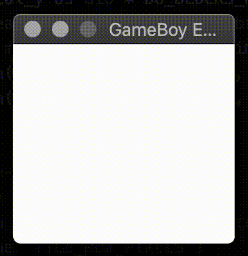

# NINTENDO&reg; GameBoy&trade; Emulator 

> NINTENDO&reg; GameBoy&trade; emulator written in Rust

## Setup & Running

You can either `cargo run` the current project (for debugging) or you can `cargo install --path <path>`
this project (and its compiled binary).

## Current Status

> Booting emulator, with initial Video emulation

## Development steps

* [x] CPU and RAM
* [ ] Video
* [ ] ROM (ROM ONLY, MBC1, MBC1-RAM0, MBC1-RAM1)
* [ ] Controllers
* [ ] Audio
* [ ] Tuning, Optimization, and Compliance to the original hardware
* [ ] Bluetooth Joystick (PS4 DualShock 4)

## Issues

Please take a look at [/issues](https://github.com/earaujoassis/gameboy-emulator/issues)

## License

"GAME BOY" and "NINTENDO" are trademarks of NINTENDO OF AMERICA, INC. This current project
has the sole purpose of testing and studying Computer Architecture and Organization. The
code here presented is licensed under the [MIT License](http://earaujoassis.mit-license.org/).
Copyright &copy; Ewerton Carlos Assis.
